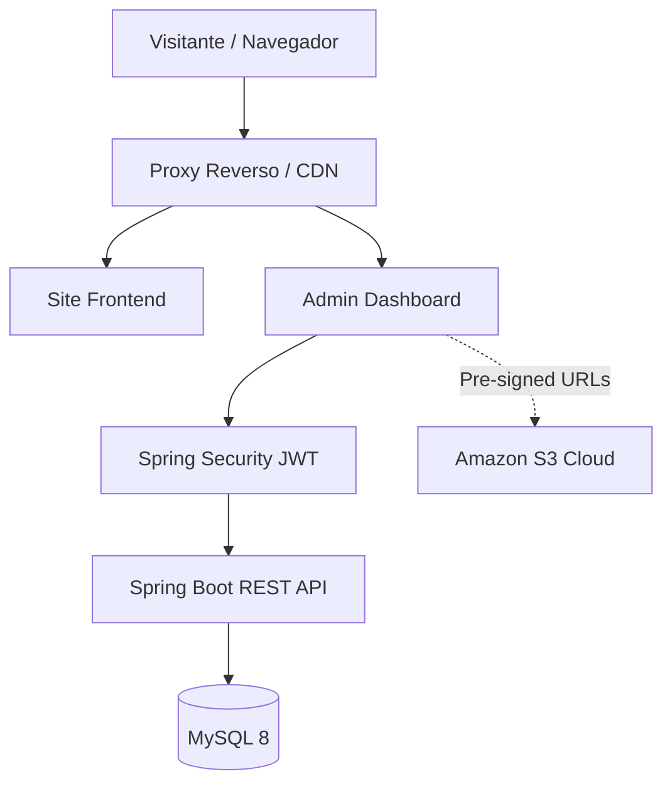

# Plataforma Digital Premium: Carlos Rosa 🎬


> *“A tecnologia deve amplificar a fotografia, nunca competir com ela.”*

Uma plataforma digital corporativa (*Monorepo*) projetada sob medida para um Fotógrafo e Filmmaker de padrão internacional. Composta de um **site público escalável e de alto desempenho**, ancorado a um **CMS robusto e ultra-seguro (Painel Administrativo)**.

O design do sistema incorpora um modelo **Dark Luxury** (Pretos profundos e acentos em ouro velho Cinematic), garantindo progressão visual contínua sem comprometer a semântica, segurança ou a performance.

---

## 🏗️ 1. Arquitetura da Plataforma

O código reflete rigorosamente o desacoplamento de responsabilidades entre Apresentação, Orquestração e Processamento Físico de Imagens.



### 🗃️ O Stack Tecnológico

1. **Frontend Público (Conversão Máxima):** HTML5 Semântico, CSS3 Modular (Vanilla com *CSS Tokens*), JavaScript Ultra Leve (Fallback System e Intersections).
2. **Backend (A Espinha Dorsal):** *Java 21 + Spring Boot 3*. Desenhado seguindo princípios SOLID, utilizando `Controllers`, `Services`, `DTOs` e `Entities`.
3. **Database (Estado e Modelagem):** MySQL Relacional blindado via `Flyway Migrations`. Relacionamentos complexos mapeando `Roles`, `Políticas (RBAC)`, `Portfolio` e `Eventos Live`.
4. **Infraestrutura / Cloud:** AWS S3 SDK e Orquestrador **Docker Compose**.

---

## 🔒 2. Pilares de Segurança Adotados (OWASP & Threat Model)

A plataforma não foca apenas na estética, a exigência de base foi uma segurança bancária acoplada na camada de rede.

- **Proteção Completa State-less (JWT e CORS):** Rotas administrativas exigem Autorização via `Bearer` injetado pelo interceptor do Spring Security. 
- **Upload Seguro (AWS Bypass):** A arquitetura elimina arquivos gigantes transitando pela API. A API Java (apenas o que tem a Role ADMIN), gera uma URL especial (`Pre-signed`), permitindo que a imagem seja injetada via CDN (AWS) poupando memória do Servidor Principal.
- **Role-Based Access Control (RBAC):** Os Endpoints verificam permissões contextualmente (Ex: `@PreAuthorize("hasAnyRole('ADMIN', 'EDITOR')")`).
- **Validação de Conteúdo Type (`MIME`)** para evitar injetar scripts no lugar de fotografias (*Security Controller Mitigation*).

---

## ✨ 3. Design System & Interface

Focando no minimalismo luxuoso e tipografia sofisticada:

- **Fonte Primária (Display):** *Cinzel* (Elegância brutalista e cinematográfica).
- **Leitura (UI):** *Inter* (Alta clareza e ritmo geométrico para leitura prolongada).
- **Fallback Progressivo:** Interações tridimensionais, zoom suave na imagem (*grayscale -> colorful* over hover), utilizando `devicePixelRatio` com reduções conscientes de peso onde não for suportado 3D pesado.

---

## 🚀 4. Como Executar (Ambiente Dockerizado)

O modelo possui variáveis pré-definidas para Dev. Todo o cluster de rede isolado pode ser instanciado em questão de segundos.

### Instalação e Subida Rápida
1. Baixe este Repositório e certifique-se de que o **Docker Desktop** esteja aberto.
2. Copie `env.example` ou crie seu arquivo `.env` na raiz. 
3. Execute o script de Compose:
```bash
docker-compose up -d --build
```
    
### Acesse o Ecossistema Local
* 🌐 **Vitrine/Portfólio (Público):** [http://localhost/](http://localhost/)
* 💼 **CMS Dark Luxury (Acesso Restrito):** [http://localhost/admin/](http://localhost/admin/)
* ⚙️ **Endpoints da API Java:** [http://localhost:8080/api/v1/...](http://localhost:8080/api/v1/...)

> *A migração `V1_Create_Initial_Schema` do Flyway irá, de forma assíncrona, popular o schema no banco na subida inicial do container do backend Java.*

---

## 📸 5. Entregáveis do "Prompt Master" Validados
* [x] **Discovery e UX Flow** (`docs/ETAPA-3_UX_UI.md`)
* [x] **Modelagem de DB, Migrations e RBAC** (`database/V1_Create...`)
* [x] **Construção Segura da API Backend** (Filtros JWT, Controladores AWS)
* [x] **Interfaces do Fotógrafo (Front & Admin)**
* [x] **Documentações de Proteção Cloud de App Sec** (`docs/ETAPA-8_SECURITY.md`)

*Idealizado para um modelo robusto, permitindo evolução gradativa durante anos sem necessidade de reescritas monoliticas.*
